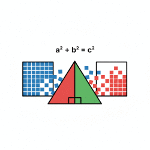

# PythaLogik
<link rel="stylesheet" href="style.css">

Welcome to the interactive game for learning Pythagoras Theorem!

  

  <a href="/Index.html" style="display: inline-block; padding: 10px 20px; font-size: 16px; background-color: #007bff; color: white; border-radius: 5px; text-decoration: none;">Let's Begin</a>

